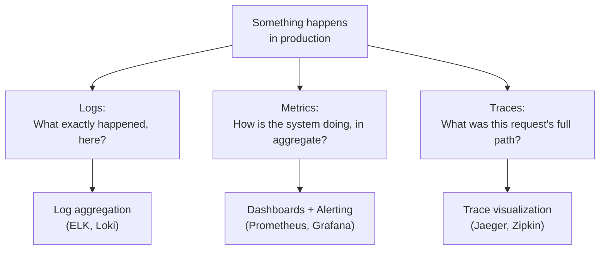
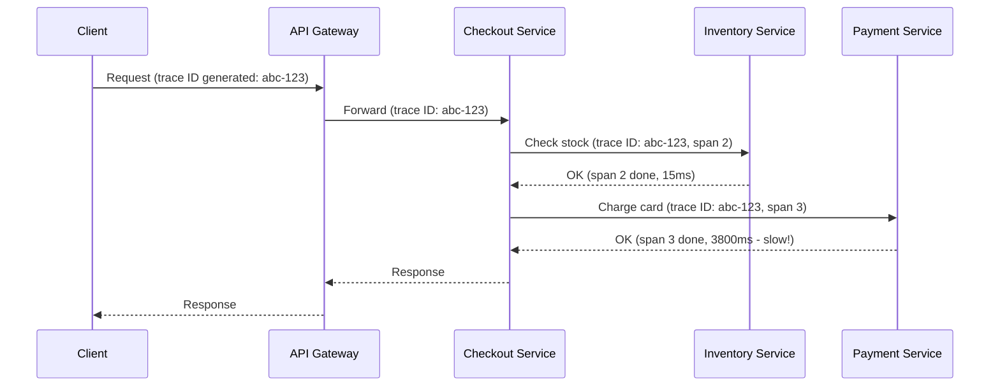
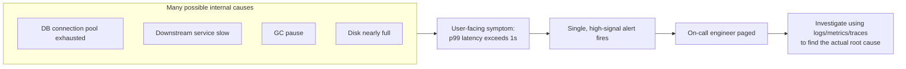

# Diagrams: Observability

## 1. The Three Pillars and What Each Answers

*Each pillar captures a different dimension of system behavior — none of them alone gives a complete picture of a distributed system.*

## 2. Distributed Trace Across Microservices

*The same trace ID (abc-123) is propagated through every service call, letting a tracing tool reconstruct the full path and immediately show that the Payment Service's span accounted for nearly all of the request's latency.*

## 3. Alerting on Symptoms, Not Every Internal Cause

*Alerting directly on user-facing symptoms (not every possible internal cause) keeps the signal-to-noise ratio high — the actual root cause is found afterward, during investigation, using the other observability pillars.*
