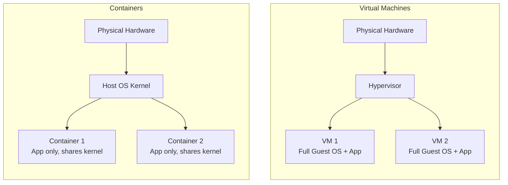
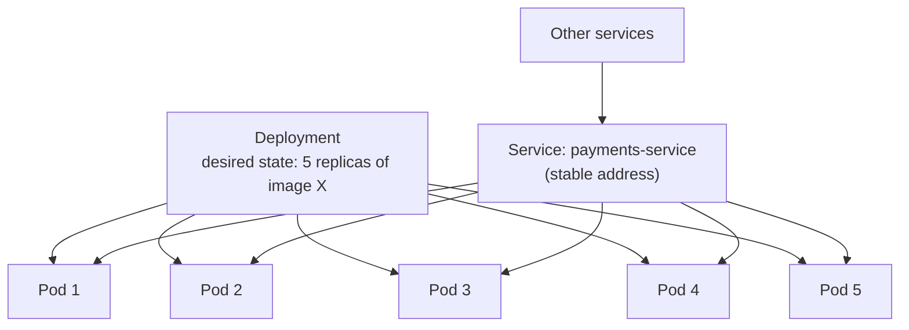
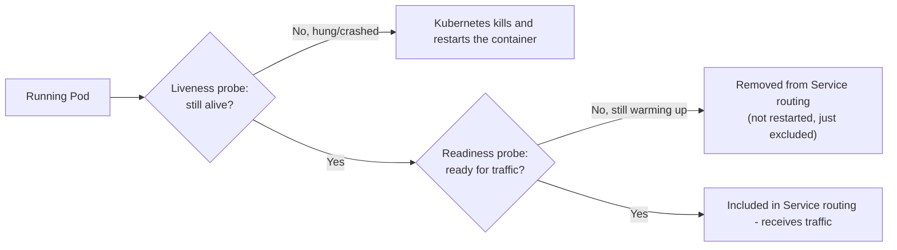

# Diagrams: Containers & Orchestration

## 1. Virtual Machines vs. Containers

*Each VM carries its own full OS kernel, adding significant overhead. Containers share the host's kernel and isolate only the application layer, making them far lighter and faster to start.*

## 2. Kubernetes Core Objects Working Together

*A Deployment keeps the desired number of Pods running; a Service gives callers one stable address that routes to whichever Pods are currently healthy, regardless of which specific ones exist at any moment.*

## 3. Liveness vs. Readiness Probes

*A failed liveness probe triggers a restart; a failed readiness probe just excludes the pod from receiving traffic until it recovers, without killing it — two different problems, two different responses.*
