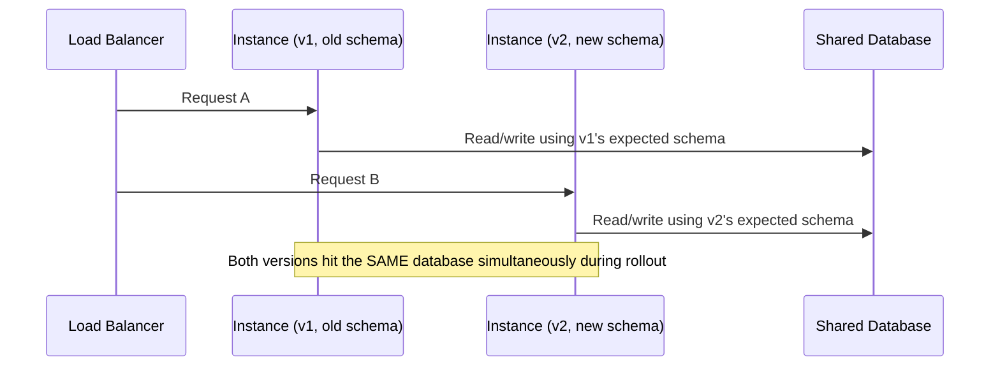
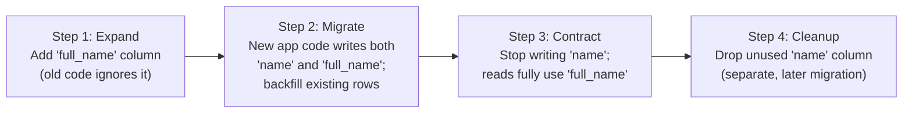

# Diagrams: Zero-Downtime Deployments & Database Migrations

## 1. Rolling vs. Blue-Green vs. Canary

```mermaid
flowchart TB
    subgraph Rolling["Rolling Deployment"]
        R1["v1, v1, v1, v1, v1"] --> R2["v2, v1, v1, v1, v1"]
        R2 --> R3["v2, v2, v1, v1, v1"]
        R3 --> R4["v2, v2, v2, v2, v2"]
    end

    subgraph BlueGreen["Blue-Green Deployment"]
        B1["Blue (v1): 100% traffic<br/>Green (v2): 0% traffic, deploying"] --> B2["Blue (v1): 100% traffic<br/>Green (v2): fully deployed, health-checked"]
        B2 --> B3["Router switches:<br/>Green (v2): 100% traffic<br/>Blue (v1): idle, ready for rollback"]
    end

    subgraph Canary["Canary Deployment"]
        C1["v2: 5% traffic<br/>v1: 95% traffic"] --> C2["v2: 25% traffic<br/>v1: 75% traffic<br/>(metrics look healthy)"]
        C2 --> C3["v2: 100% traffic<br/>v1: 0% traffic"]
    end
```

*Rolling replaces instances gradually with roughly constant capacity; blue-green cuts over atomically between two full environments; canary ramps up new-version traffic gradually while watching for problems.*

## 2. Why Old and New Versions Must Stay Compatible Mid-Rollout

*During any rolling or canary rollout, both old and new instances query the same shared database at the same time — a schema change must work correctly for both versions, or one of them starts failing mid-deploy.*

## 3. Expand-Contract Pattern for a Database Migration

*Each step is independently safe for any mix of old and new application instances running simultaneously — the risky move is skipping straight from step 1 to step 4 in one deploy.*
