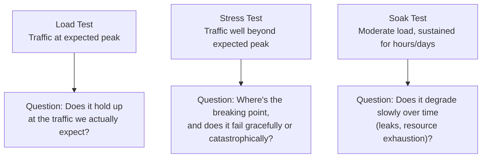
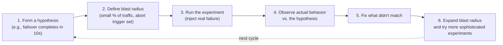
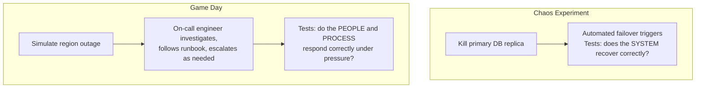

# Diagrams: Testing Distributed Systems

## 1. Three Kinds of Load Testing

*Each testing type answers a distinct question about how the system behaves under traffic — expected, extreme, or sustained.*

## 2. The Chaos Engineering Loop

*Chaos engineering is a disciplined, repeatable loop — not random destruction — that almost always surfaces a gap between designed and actual behavior, which is exactly its value.*

## 3. Chaos Experiment vs. Game Day: What Each Actually Tests

*A chaos experiment tests whether the automated system recovers as designed. A game day goes further, testing whether the humans and documented procedures around it actually work when something breaks.*
