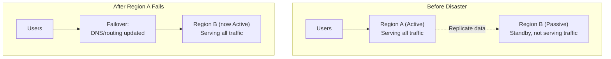
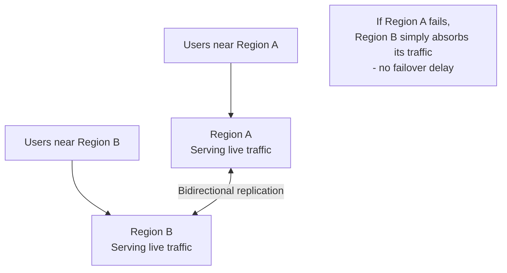
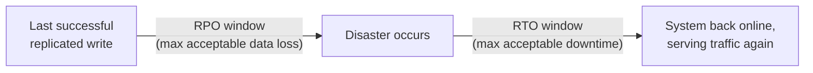

# Diagrams: Multi-Region Architecture & Disaster Recovery

## 1. Active-Passive Failover

*Under normal operation, Region B sits idle with replicated data. After a failure, traffic is redirected to it — but that redirection itself takes time, which RTO defines an acceptable limit for.*

## 2. Active-Active: Every Region Serves Traffic

*Both regions serve traffic simultaneously, routed by proximity — if one fails, there's no single point that needs to "take over," but writes accepted in both places must be reconciled.*

## 3. RTO and RPO on a Timeline

*RPO measures backward from the disaster — how much recent data could be lost. RTO measures forward from the disaster — how long until service is restored. Both are business-defined targets that drive the actual architecture choice.*
